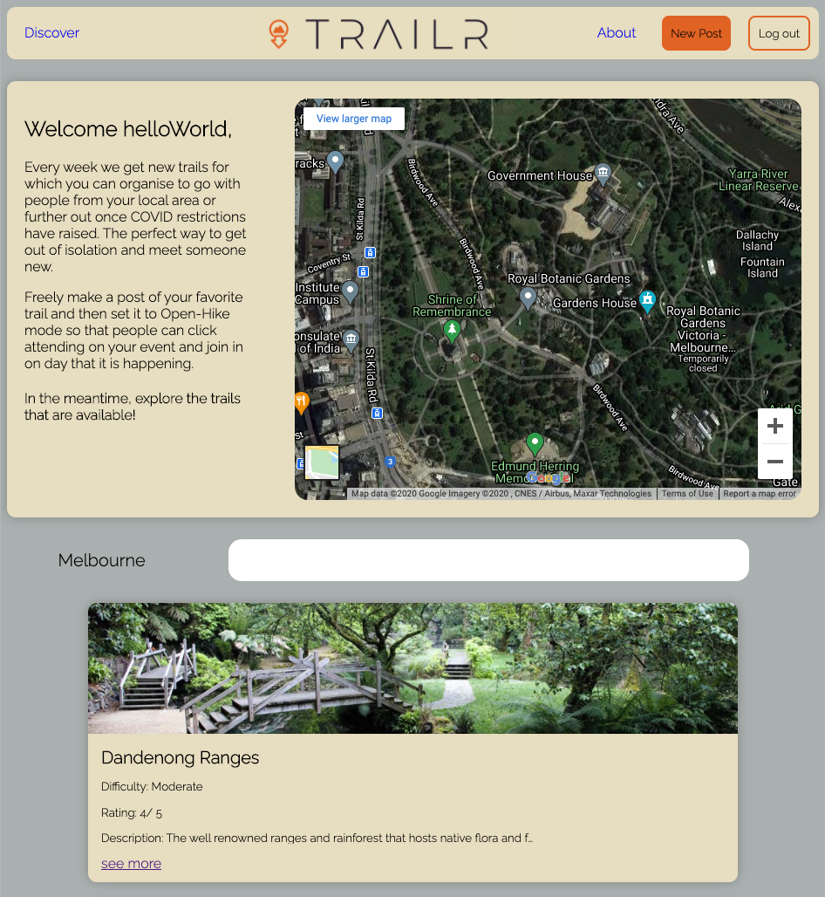
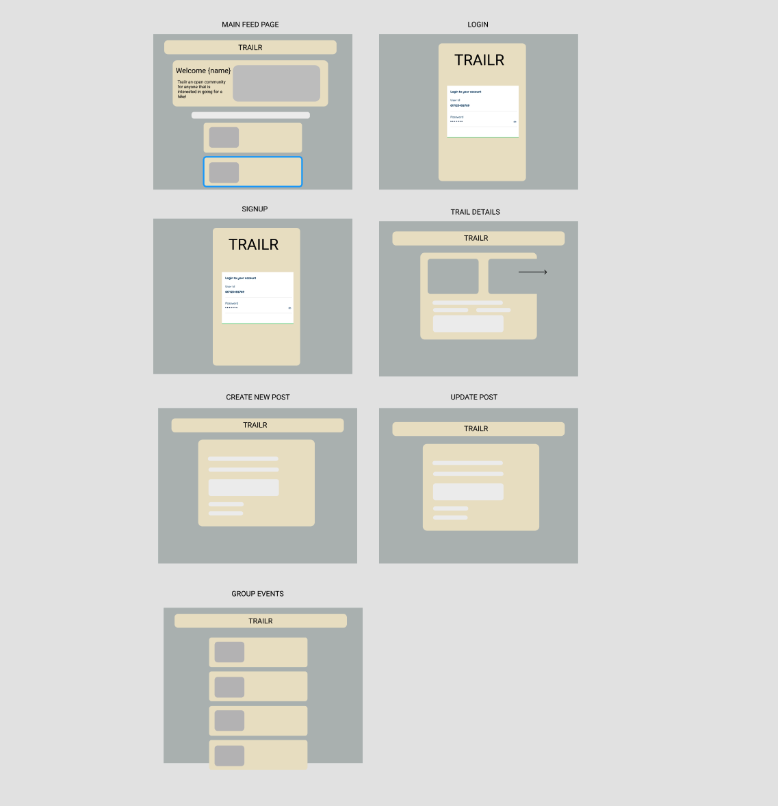
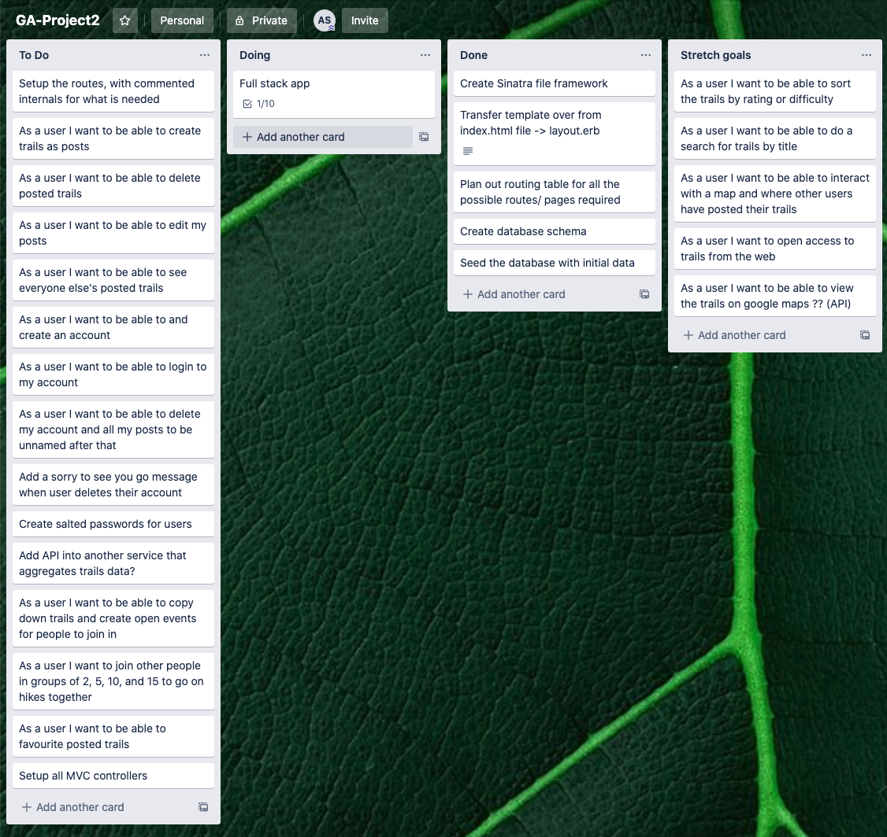

# TRAILR: Open hiking platform 

Have a look [here](https://rocky-hollows-48883.herokuapp.com/)

Trailr is a CRUD app build with Ruby and microframework Sinatra that allows people who are feeling isolated or lonely to browse popular walking trails and join as pairs to the posted 'open-hikes' or (when restrictions are lifted from COVID19) as groups of 5, 10, 15 to go walking/ hiking together. 

#### Technologies used 
- Ruby/ Sinatra
- PostgreSQL
- Google Maps Embed API
- BCrypt [password hashing](https://github.com/codahale/bcrypt-ruby)
- HTML/ CSS 

# Application Features 

Using the app you will notice that you can create, read, update and delete posts as as mentioned before it has all the fundamental features of a CRUD application. As development progresses I would ideally like to add features where the user can have a profile page and have all their favorite trails stored there along with the open-hike events and the date they will be attending them (Notifications and reminders included). Also ideally there would be a comment and rating capability for users to use. 

#### Hidden Features 

- To get to home screen click on the TRAILR logo 
- Everything else should be taken at face value. 

## Initial Wireframing 

Check out my [figma wireframe](https://www.figma.com/file/MDJA29VCB2Cwx7YwBoSujw/Untitled?node-id=0%3A1)

Here is the initial [trello board](https://imgur.com/7xkze9v)

..and the most up to date (evergrowing) [trello board](https://trello.com/b/Gtl7giGf)

## IMPROVEMENTS 
- Implement desired features that were leftover after 2.5 day sprint finished. 
- For all else see trello board 
